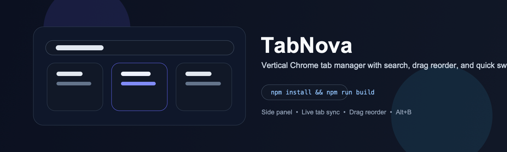

<p align="center">
  
</p>

<h1 align="center">TabNova</h1>

<p align="center">
  Vertical Chrome tab manager focused on fast switching, filtering, and drag-based reordering.
</p>

<p align="center">
  <a href="#installation"></a>
  <a href="#installation"></a>
  <a href="#installation"></a>
</p>

<p align="center">
  <code>npm install && npm run build</code>
</p>

TabNova moves tab management into the Chrome side panel so you can search, reorder, switch, and close tabs without relying on the default horizontal tab bar.

## At a Glance

- Vertical tab list with live tab updates from the current window
- Drag-and-drop reordering plus fast close and instant switching
- Search, bookmark, history, and settings views inside one side-panel workflow

## Why TabNova

- Horizontal tabs stop scaling once a browsing session gets dense
- The side panel makes tab state easier to scan and manipulate
- Search and shortcuts are treated as part of navigation, not secondary utilities

## Core Features

- Vertical side-panel tab view
- Real-time tab filtering
- Drag-and-drop reordering
- One-click switching and close on hover
- Bookmark and history views
- Theme, accent color, and language settings
- `Alt+B` / `Option+B` shortcut support

## Installation

### Requirements

- Node.js 18+
- Chrome with extension developer mode enabled

### Build

```bash
npm install
npm run build
```

Load the generated `dist/` folder from `chrome://extensions` using **Load unpacked**.

## Usage

- Open the side panel with the toolbar icon or `Alt+B`
- Filter tabs by title or URL
- Drag tabs to reorder them
- Open a new web search from the search field
- Move between tabs, bookmarks, and history without leaving the panel

## Development

```bash
npm run dev
npm run type-check
npm run build
```

## Contributing

Before opening a PR:

```bash
npm run type-check
npm run build
```

Issue reports should include:

- Chrome version and OS
- Reproduction steps
- Expected vs actual behavior
- Whether the problem affects tabs, bookmarks, history, or settings

Recommended commit prefixes: `feat`, `fix`, `docs`, `refactor`, `test`, `chore`

## License

ISC
